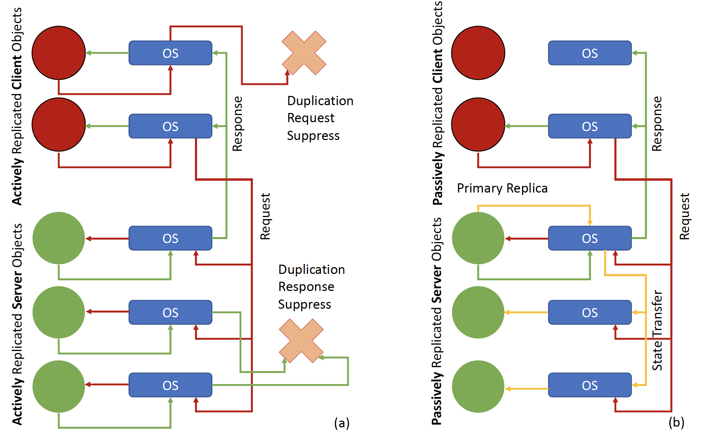

# 18749-project

The flagship project involved the design and implementation of an industry-grade fault-tolerant distributed system, with heartbeats, distributed consensus, total ordering, checkpointing, and logging to provide strong consistency for a distributed replicated application. This project involved supporting different replication styles (active, or hot-swap replication, as well as  passive, or primary-backup replication), along with mechanisms to ensure no downtime even as faults are injected.



## Set-up Steps
### Replication Manager (Machine-1)
Run command: 
```
python replicate_manager.py
```

### Global Fault Detector (Machine-1)
Run command: 
```
python global_fault_detector.py
```

### Clients (Machine-1)
1. Take care of line 8, rm_ip before running the code
2. Run on the same machine with RM and GFD
3. Multiple clients can be launched with different <client_id> in the run command.

Run command:
```
python client.py <client_id>
```


### Local Fault Detector (Machine-2/Machine-3/Machine-4)
1. Change line 12, gfd_ip_address to the Machine-1 IP
2. Run on the same machine with its server
```commandline
python local_fault_detector.py
```

### Replica/Server (Machine-2/Machine-3/Machine-4)
Run command: 
```
python server.py
```

## Active Replication Testing Step:
1. Launch the RM
2. Launch the GFD
3. Launch LFD-1 and Server-1
4. Launch LFD-2 and Server-2
5. Launch LFD-3 and Server-3

------ End of Fault-free Testing ------

------ Start Fault Testing ------

6. Kill one of the server
7. Wait for some time
8. Bring back the dead server
9. Clients and the other two server should work normally and consistently during these steps 
and the membership changes should be broadcasted to all clients and existing servers


## Passive Replication Testing Step:
1. Launch the RM
2. Launch the GFD
3. Launch LFD-1 and Server-1 (Primary)
4. Launch LFD-2 and Server-2 (back-up 1)
5. Launch LFD-3 and Server-3 (back-up 2)

------ End of Fault-free Testing ------

------ Start Fault Testing ------

1. Kill one of the back-up server
2. Wait for some time
3. Bring back the dead back-up server


1. Kill the primary server
2. Wait for some time
3. Bring back the dead primary server (it should become back-up now)


Clients and the other two server should work normally and consistently during these steps 
and the membership changes should be broadcasted to all clients and existing servers
